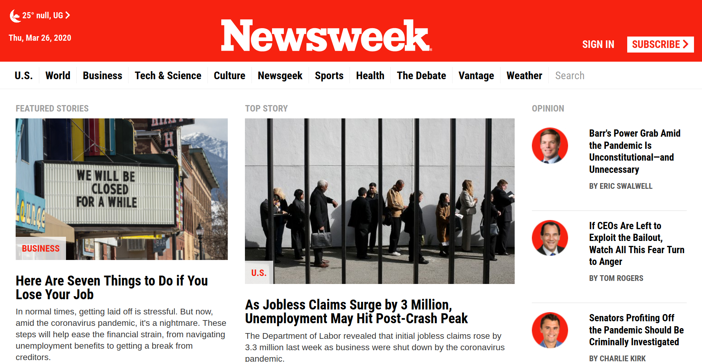

# The Newsweek Homepage

## Project Description
This project required that we replicate [The Newsweek Homepage](https://www.newsweek.com/) using a css grid framework. I used boostrap to create this project in its responsive nature. I also exploited some of the utility classes just to make all elements appear well on the homepage throughout all the screen viewports.

## How it was Implemented

I considered creating the desktop view first then continued to make it responsive with smaller and bigger screen sizes using the .col-md-*, .col-sm-* and .col-lg-* bootstrap classes.
Since it is a framework, these classes are already defined in the boostrap.css minified file.

Please checkout the live version of the implemented project [here](https://raw.githack.com/Cathella/Newsweek/home/index.html)

## Built With

* HTML5
* CSS
* VSCode
* Google fonts
* Bootstrap 4

## Authors

👤 **Nakitto Catherine** 
* Github: [@githubhandle](https://github.com/Cathella)
* Twitter: [@twitterhandle](https://twitter.com/cathella9)
* Linkedin: [linkedin](https://www.linkedin.com/in/catherine-nakitto-51ba2a40/)

## 🤝 Contributing

Contributions, issues and feature requests are welcome!
Feel free to check the [issues page](issues/).
